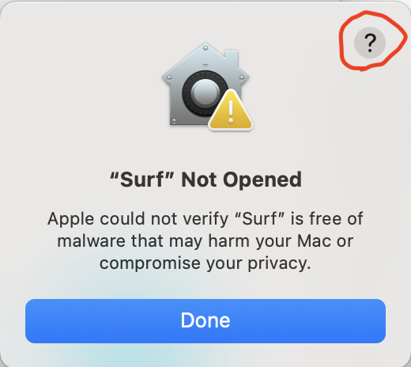
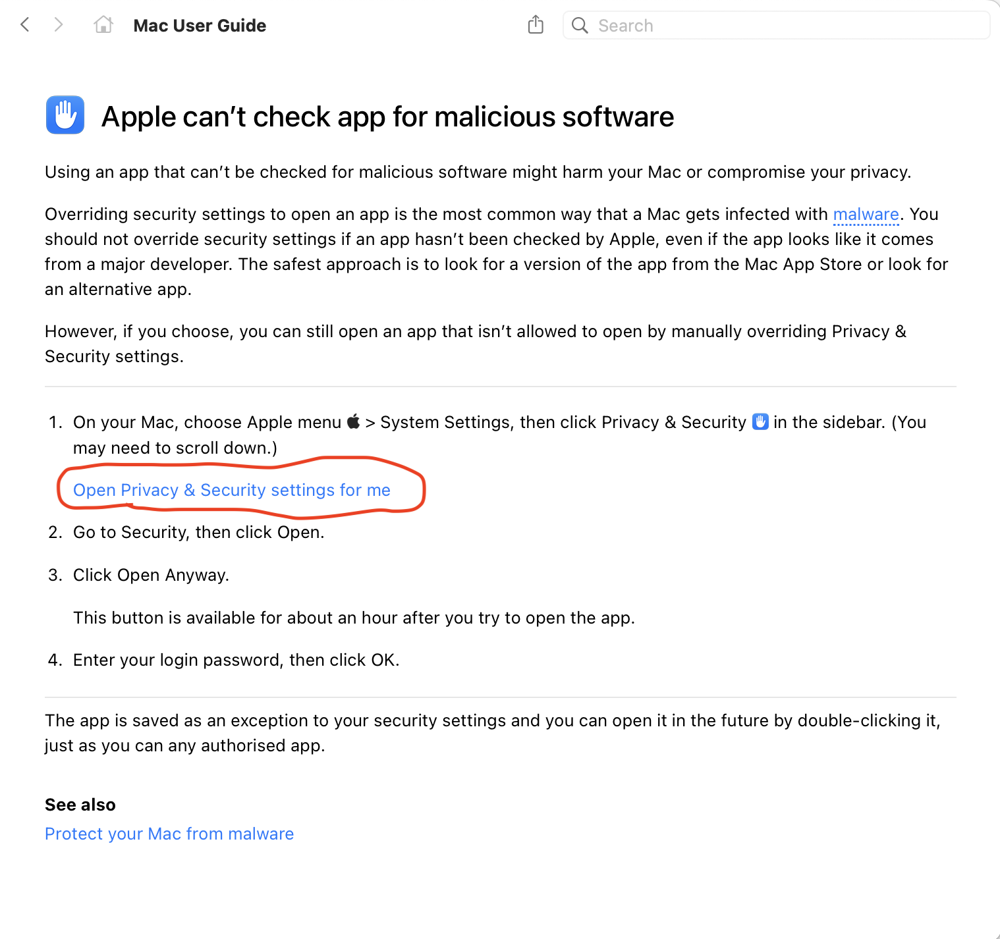
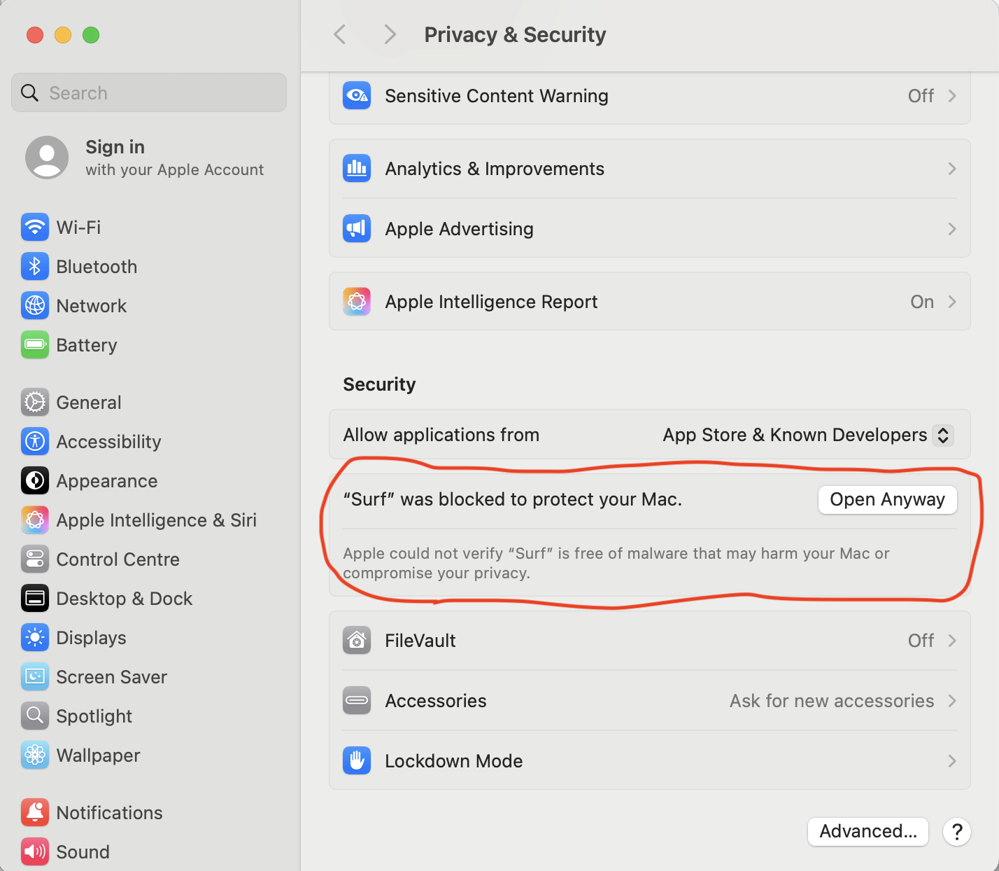
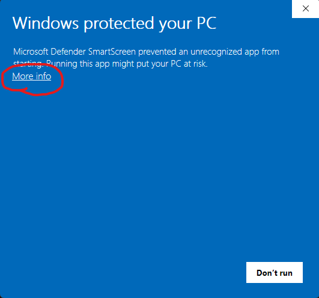
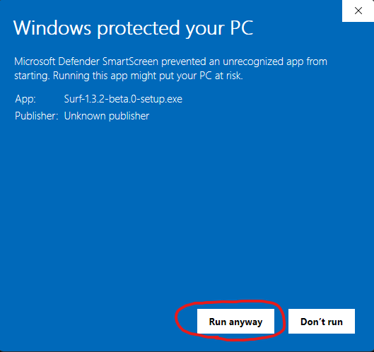

# Installing Surf

Surf is available as an open source release for macOS, Windows, and Linux. Follow the instructions below to download and install Surf on your machine.

- [Download](#download)
- [macOS Security Warning](#macos-security-warning)
- [Windows Security Warning](#windows-security-warning)
- [AI](#ai)
- [Migrating from managed Surf](#migrating-from-managed-surf)

## Download

Get the latest version of Surf from [GitHub Releases](https://github.com/deta/surf/releases/latest).

| Platform              | Download File                |
| --------------------- | ---------------------------- |
| macOS (Apple Silicon) | `Surf-x.y.z.arm64.dmg`       |
| macOS (Intel)         | `Surf-x.y.z.x64.dmg`         |
| Windows (x64)         | `Surf-x.y.z-setup.exe`       |
| Linux (x64 AppImage)  | `Surf-x.y.z.x86_64.AppImage` |

_Note: Replace `x.y.z` with the version number from the latest release._

## Security Warnings

When installing or opening Surf, you may see security warnings from your operating system. This is expected because the open source releases aren't currently signed. Follow the steps below for your platform.

### macOS Security Warning

MacOS may display a warning that "Surf can't be opened because Apple cannot check it for malicious software."

**Quick fix:** Right-click the Surf app and select "Open" from the menu. You only need to do this once.

**If that doesn't work:**

1. Try opening Surf again using the right-click method, then click the `?` icon in the top-left corner of the warning dialog.

2. Click on "Open Privacy and Security Settings for me" from the help guide.

3. In System Preferences, scroll to the "Security" section and click "Open Anyway" on the message displayed for Surf.

### Windows Security Warning

Windows Defender may warn that "Windows protected your PC."

Click **"Run anyway"** (or **"More Info"** then **"Run anyway"**) to proceed with installation.

## AI

To get the AI in Surf working, make sure to get an API Key and follow the instructions in [AI Models](AI_MODELS.md#configuring-the-built-in-models).

## Migrating from managed Surf

Deta published a version of Surf that came with built-in AI capabilities, code signing, automatic updates & extensions. 

If you are migrating from that version to this open source version, your data will not be lost. Surf stores all your data locally on your machine. You can follow the instructions in [Data Ownership](LIBRARY.md#data-ownership) to find where your data is stored.

To get the AI features working in this open source version, follow the instructions in [AI Models](AI_MODELS.md#configuring-the-built-in-models).